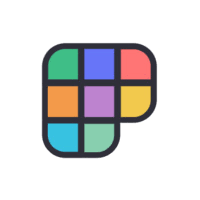

  
  <a href="https://www.instagram.com/topitosnook">
  
  
  

# Forever WIP - Hi there, I'm Valeria
 :rainbow: Pronouns: She/her 
 :white_flower: Currently a Student at Laboratoria's FrontEnd Bootcamp
 :ocean: Oceanographer | Ocean Sciences College Degree
 :paw_prints: I have four quadruped children
 :scroll: Current favorite book/story: One Piece :anchor:
 :honeybee: Personal interests: Accesibility, inclusion, managment and administration, languages, science 
 :notes: :musical_keyboard: :trumpet: :guitar: I play no instruments ... but I love them all :stuck_out_tongue_closed_eyes:

## Technologies and Tools

[][tech_tools_anchor]
&nbsp;
[][tech_tools_anchor]
&nbsp;
[][tech_tools_anchor]
&nbsp;
[][tech_tools_anchor]
&nbsp;
[][tech_tools_anchor]
&nbsp;
[][tech_tools_anchor]
&nbsp;
[][tech_tools_anchor]
&nbsp;
[][tech_tools_anchor]
&nbsp;
[][tech_tools_anchor]
&nbsp;
[][tech_tools_anchor]
&nbsp;

## Currently learning and improving

---

[][learning_now_anchor]
&nbsp;
[][learning_now_anchor]
&nbsp;
[][learning_now_anchor]
&nbsp;
[][learning_now_anchor]
&nbsp;
[][learning_now_anchor]
&nbsp;
[][learning_now_anchor]

## Interest in learning at some point

[][learning_next_anchor]
&nbsp;
[][tech_tools_anchor]
&nbsp;

[tech_tools_anchor]: #bonjour--
[learning_now_anchor]: #learning-now
[learning_next_anchor]: #learning-next
